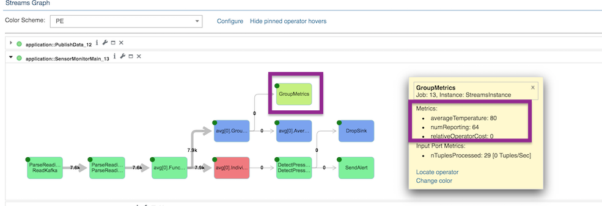

## Sensor monitor application

This application demonstrates creating a rolling average using event time windows, i.e. using the timestamp in the data and not system time.

Tutorials related to this sample:
-------

- [Watch this video](https://developer.ibm.com/streamsdev/videos/compute-time-based-averages-using-the-aggregate-operator/) to see how to add event time windows to your application.
- [Follow this videO](https://www.youtube.com/watch?v=DzH-yZ7PkH0)to see how to extend this application to send alerts to Slack.

It is a two part application:
  - **PublishData** application generates sensor data and sends it to IBM Event Streams.
  - **SensorMonitor**: Receives data from IBM Event Streams and:
    - Computes simple rolling average pressure and temperature for each sensor and for all sensors. (See `Averages` composite in Utilities.spl)
    - Detects when the reported average pressure for a sensor drops: (`MonitorPressure` in Main.spl)
   - Updates the computed rolling average when tuples arrive late: (SensorMonitorLateData.spl).
   - Uses the `MetricsSink` operator to  create a custom metric that can be pinned in the Streams Console. (Line 24 of SensorMonitorMain.spl)

# Run the application:

## Basic application that doesn't connect to IBM Event Streams
Build with Streams Studio, Atom, or using the Makefile, then run the `SensorMonitorMain_NoMHub` application.
- Optional Parameters:
    - `window_size_in_seconds`: Duration of the rolling average, default is 15 second rolling average of each sensor's data.
    -  `numSensors`: Number of sensors to simulate.

## Full application that uses a connection to IBM Event Streams
Before getting started, you will need to perform the following:

- [Create an instance of the IBM Event Streams service](https://cloud.ibm.com/catalog/services/event-streams)
- Create credentials for the service(found under the *Service credentials* section of the service instance).  See [this link for step by step instructions](https://console.bluemix.net/docs/services/MessageHub/messagehub127.html#connect_standard_external)
- Copy and paste the credentials into `etc/messagehub.json`.
- Create a topic called `sensorData` in the Event Streams Service.
- Launch `PublishSensorData` first to send sensor readings to IBM Event Streams.
    - Optionally set the  `numSensors`: Number of sensors to simulate.
- Then launch `SensorMonitorMain`, which is the main application.
Optionally set the `window_size_in_seconds`, default is 15 seconds. The application will compute a 15 second rolling average of each sensor's data.

Once the application is running you can see the custom metrics in the Streams graph:
1. Open the graph
2. Hover over the `GroupMetrics` operator.
3. Under **Metrics**, you'll see 2 custom metrics: "averageTemperature", reported average temperature of the sensors, and  "numReporting", the total number of sensors reporting changes.
4. Click **Pin** to pin the metrics to the graph, as shown below:

