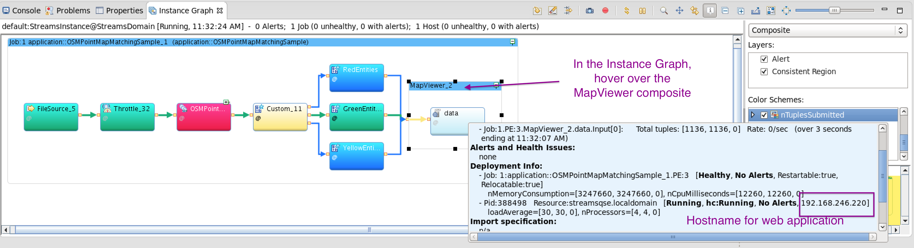

This sample application is discussed in this [StreamsDev article.](https://developer.ibm.com/streamsdev/docs/realtime-map-matching-in-streams-v4-0-1/)
It demonstrates how to use the [OSMPointMatcher operator](http://www.ibm.com/support/knowledgecenter/en/SSCRJU_4.2.0/com.ibm.streams.toolkits.doc/spldoc/dita/tk$com.ibm.streams.geospatial/spl$com.ibm.streams.geospatial$OSMPointMapMatcher.html#spldoc_compilationunit__composite_operator__OSMPointMatcher) in the Geospatial toolkit.

## Run the demo
You need:
- Version 2.7 or greater of the [com.ibm.streamsx.inet toolkit](https://github.com/IBMStreams/streamsx.inet/releases)
- The [`MapViewerSample` project](https://github.com/IBMStreams/samples/tree/main/Geospatial/MapViewerSample).

### Download the road network file
This sample demonstrates map matching in Bewdley, Ontario.  An OpenStreetMap (OSM) road network file is required to perform the map matching. So, before you can run the sample, download the OSM file:
- [Visit the OpenStreetMap export page for Bewdley](https://www.openstreetmap.org/export#map=13/44.0943/-78.3047)
- Click export in the left pane
- A `map.osm` file will be generated for download. Download the file and save it as `bewdley.osm` in the `etc` folder of this  application.

### Compile the application
Once the OSM file is saved in the `etc` folder,
- Import the projects into Streams Studio
- Compile and launch the OSMPointMapMatchingSample application and launch it in Distributed mode.

### View the map matching results
Once the application is running, go to http://PE HOST:8080/map/map.html, where `PE HOST` is the host where the Map Viewer operator in the application is running.

See the image below for how to find out the PE host.

Running application:
The green markers represent raw GPS locations. The yellow and red markers represent mapped locations on the road.

