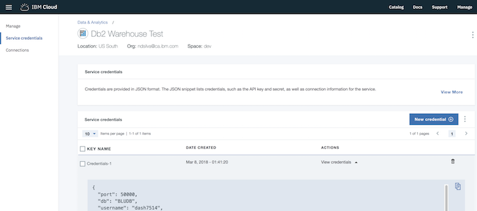
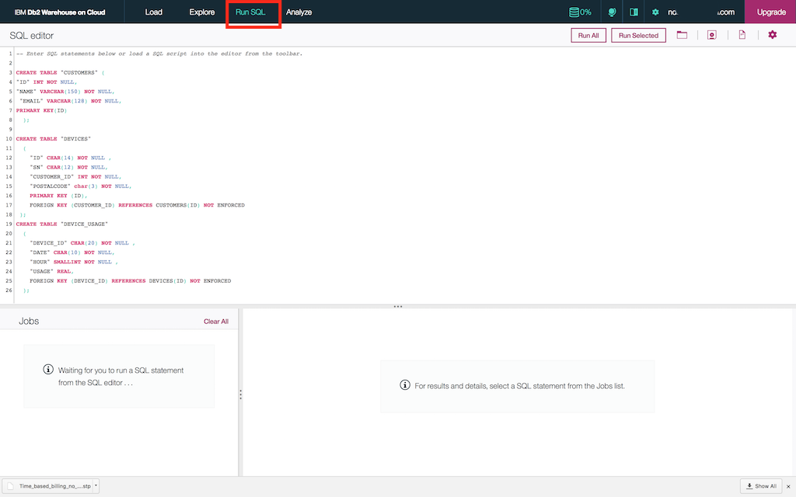
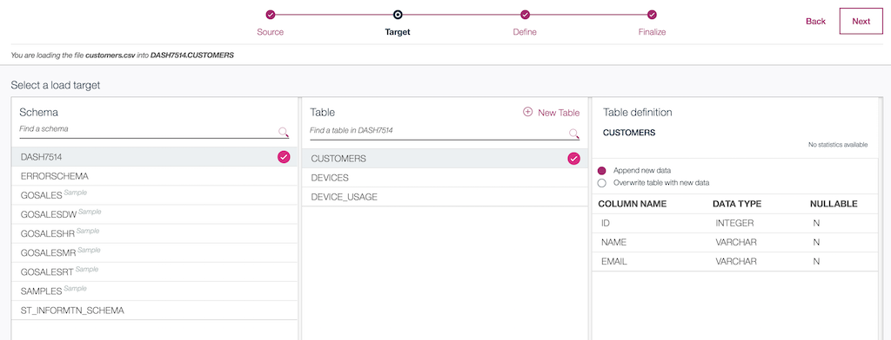

# Time based billing application.

Some utility companies offer smart meters that send usage readings from homes and businesses, improving accuracy and enabling remote reporting. Since the smart meters have more fine grained usage data, some companies are offering discounts to customers if their consumption is during off peak periods. 
This sample demostrates such an application in Streams Designer, and the videos  "Use IoT data in Streams Designer" and  "Use Python Code in a Streams Designer Flow" show how it was done.

These applications demonstrate how to do the following in Streams Designer:
- Connect to the Watson IoT platform
- [Use the Code operator to retrieve data from DB2](#appendix)
- Use the Email operator to send an alert
- Use the DB2 Warehouse operator to save data to DB2


## Prerequisites
- Basic knowledge of Streams designer
- An instance of the [Watson IoT Platform service](https://console.bluemix.net/catalog/services/internet-of-things-platform) in the IBM Cloud.
- Optional: An instance of the [DB2 Warehouse service](https://console.bluemix.net/catalog/services/db2-warehouse) in the IBM Cloud.

## What's included in this sample:
- Python notebook to simulate data from utility meters
- `.ddl` file to create the tables in the DB2 Warehouse, as well as sample data in `.csv` files to populate the database.
- 2 versions of the Streams flow:
  - Time_based_billing_no_DB2_connection.stp: Import this flow into Streams Designer if you do not wish to set up a DB2 connection.  This version of the application does not save any data to DB2.
  - Time_based_billing_app.stp: Full application. Retrieves customer email address from DB2 and also saves the hourly usage costs to a DB2 Table called `DEVICE_USAGE`.


## Get started
1. Import either the `Time_based_billing_no_DB2_connection.stp` flow or `Time_based_billing_app.stp` into Streams Designer. If using the DB2 enabled flow, see the `DB2 Setup` section below.
2. Follow the instructions in the video "Use Iot Data in Streams Designer" to:
  - Set up the Watson IoT operator
  - Register a device

3. Start sending generated utility readings to the Watson IoT Platform :
  - Locally:
      - Install the `ibmiotf` package using `pip`.
      - Edit  `send_data_to_iotplatform.py` with your device credentials where indicated.
      - Run the script: `python3 send_data_to_iotplatform.py`
  - In the Data Science Experience: Import the notebook `Utility meter simulator.ipynb`. Follow the instructions therein to   start sending data.
4. Configure the email operator:
  - Provide the details for your SMTP server. If you do not have one, you can use the free SMTP server provided by Gmail and replace the username and password with your gmail username and password. You will have to [enable access from less secure apps](https://support.google.com/accounts/answer/6010255?hl=en) in your Gmail account first.
5. (Optional) DB2 Setup:
  - Get credentials from your DB2 Instance: After creating the instance, open the instance management page in IBM Cloud. Click "Service Credentials". If there are no credentials listed, click "New Credentials" to create some. Copy the credentials.
  
  - Edit the "Get customer info" operator in the flow with your credentials: Select the operator in the flow, and edit the indicated line in the `init` function:
  
  - Access the DB2 Warehouse dashboard: Click "Manage" from the instance management page, and click "OPEN":
  
  - Create the tables:  Click *Run SQL*. Paste the contents of the `utility.ddl` file from the db2 folder in the text area, and click "Run All".
  
  - Populate the `Customers` and `Devices` tables: Click "Load". Browse to the customers.csv file in the filesystem. Choose the default schemea, e.g DASH1330. Select the `CUSTOMERS` table and click "Load". Repeat these steps for the `devices.csv` file.
  
6. Configure the Cloud Object Storage. This is not required but is an alternate output destination if you are unable to configure the Email operator.
7. Run the flow


### Appendix: Using the code operator to retrieve data from DB2
The *Get customer info* Code operator in this example shows how to retrieve data from DB2 using a prepared statement and the `ibm_db` Python package.
After copying credentials from the *Service Credentials* page of your DB2 Warehouse instance, you can use them as follows:

```
import ibm_db
# Called once during initialization
def init(state):
        creds =  {
          #PASTE DB2 CREDENTIALS HERE#
        }
        #Example: creds  = {"port": 5000}..etc
        state["schema"] = creds["username"] #default DB2 schema
        state["conn"] = connect(creds)   # save the connection in the state dictionary

#return a connection to the database
def connect(creds):
    dsn_driver = "IBM DB2 ODBC DRIVER"
    dsn_database = creds["db"]            # e.g. "BLUDB"
    dsn_hostname = creds["hostname"]

    dsn_port = creds["port"]

    dsn_protocol = "TCPIP"            # i.e. "TCPIP"
    dsn_uid = creds["username"]

    dsn_pwd = creds["password"]       # e.g. "7dBZ3jWt9xN6$o0JiX!m"
    dsn = (
        "DRIVER={{IBM DB2 ODBC DRIVER}};"
        "DATABASE={0};"
        "HOSTNAME={1};"
        "PORT={2};"
        "PROTOCOL=TCPIP;"
        "UID={3};"
        "PWD={4};").format(dsn_database, dsn_hostname, dsn_port, dsn_uid, dsn_pwd)
    conn = ibm_db.connect(dsn, "", "")
    return conn
```

When you would like to retrieve data from the database, you build a prepared SQL statement using the connection:
```
def get_customer_info(event, state):        
    schema = state["schema"] # schema name where tables were created
    devices_table_name = schema + ".devices"
    customers_table_name  = schema + ".customers"
    select_statement = "select C.ID,C.NAME,C.EMAIL, D.POSTALCODE from "+ devices_table_name + " D INNER JOIN  " + customers_table_name + " C ON D.CUSTOMER_ID = C.ID AND D.ID = (?);"
    stmt = ibm_db.prepare(state["conn"], select_statement)
```
Bind parameters to the statement:
```
    ibm_db.bind_param(stmt, 1, event["device_id"])
```
Run the statement:
```    ibm_db.execute(stmt)
```

Iterate over the result set:
```   
    result = ibm_db.fetch_assoc(stmt)
    if (result):
        event["postalcode"] = result["POSTALCODE"]
        event["name"] =  result["NAME"]
        event["customer_id"]  = result["ID"]
        event["email"] = result["EMAIL"]
```
