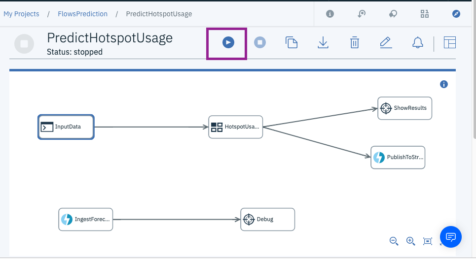
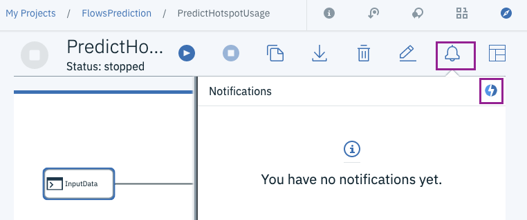
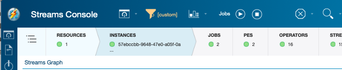
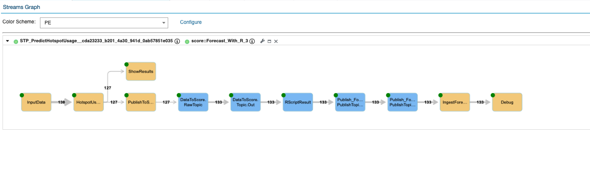
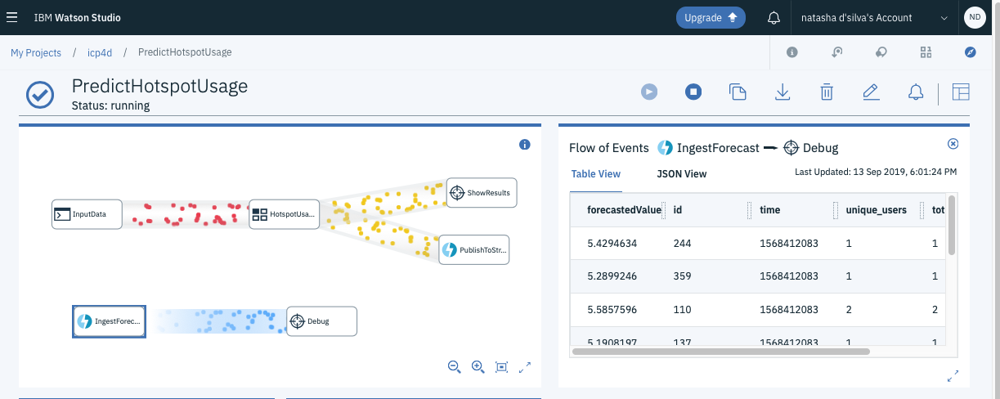
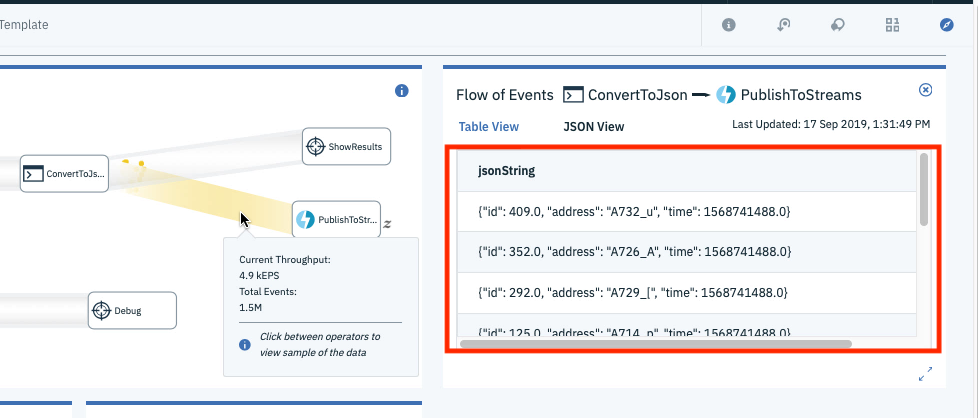

## Score streaming data with R and Streams flows

This is the sample code for the video [Score streaming data in R with Watson Studio Streams Flows](https://youtu.be/gZAoDOus0vc).
This repo includes the full application from the video and a modifiable template so you can use it with your own data.

#### Sample from the video
- Precompiled versions of the microservice are in the `bin` folder, so you can try the application without having to compile any code.
- [Sample flow from the demo](PredictHotspotUsage.stp) (uses generated data).

#### Example streams flow and SPL code.
- A template flow and template SPL code so that you can run the sample with your own data.

* Running the sample
  * [Import and run the sample flow](#import-the-sample-flow-into-watson-studio)
  * [Launch the microservice](#launch-the-forecasting-microservice)
* [Modify the sample to use your own model](#modifying-the-sample)

To run the sample, you need to
- Import and run the sample flow in Watson Studio Streams flows.
- Run the forecasting microservice in the Streaming analytics service.


### Import the sample flow into Watson Studio
First, create an account in Watson Studio and an instance of the Streaming analytics service.

- [Sign up for Watson Studio](https://dataplatform.cloud.ibm.com)  if you haven't already.
- Upload the sample flow:
  - Download the [PredictHotspotUsage.stp](LINK) file
  - From Watson Studio, [create a project](https://dataplatform.cloud.ibm.com/docs/content/wsj/getting-started/projects.html) if you do not have one.
  - Follow [these steps to upload the sample flow you just downloaded](https://dataplatform.cloud.ibm.com/docs/content/wsj/streaming-pipelines/creating-pipeline-import.html?audience=wdp&linkInPage=true).
  - Start the flow:
  


### Launch the forecasting microservice
Once the flow is running, submit the forecasting microservice. There are 2 versions of the application:
 - `bin/score.Forecast_With_R.sab`, just scores the data and publishes the results
 - `bin/score.Forecast_With_ModelUpdates.sab`  is configured to connect to Cloud Object Storage (COS) for updates to the model.

To use the application that has model updates enabled, follow the steps below to configure Cloud object storage.]LINK]

#### Launching the microservice
- From the metrics page of the flow, open the Streaming analytics dashboard by clicking  **Show notifications** > **Manage [your instance name]  in the cloud**.
  
- Once it opens, click the submit button
   
- Upload the `bin/score.Forecast_With_R.sab` file.
- Once the application is running, the streams graph should look like this:
  

You can return to the flow and see that the forecast results are being ingested correctly.
  


#### Configure Streaming analytics service to connect to Cloud object storage
If you want to run the version of the application that has model updates, you must:
1. Create an instance of Cloud Object Storage in the IBM cloud.
2. Configure your [Streaming analytics service to connect to Cloud Object Storage instance as described here](https://ibmstreams.github.io/streamsx.objectstorage/doc/spldoc/html/tk$com.ibm.streamsx.objectstorage/tk$com.ibm.streamsx.objectstorage$9.html).
3. Create a bucket called `models-demo` in your COS instance.


## Modifying the sample
This repo also includes a sample flow and template SPL code so you can try out forecasting with your own data and model.

To modify the sample to use your own model:
1. Modify the template flow to publish your own data
2. Modify the template SPL to ingest the right data
3. Change the R scripts to load and score your models

### Modify the template flow
Unlike the video, [the template flow](example/StreamsFlowForecastTemplate.stp) converts the stream of data to JSON before publishing it to the Streams instance. This makes it easy for you to set the data schema in the forecasting microservice.

- Download the template flow and  upload it to Streams flows. Connect the data stream you wish to publish  to the `ConvertToJson` node.

  
  
   
- Run the flow. Once it is running you can see the list of attributes that will be expected by clicking the stream being published:
   

In this case the data has the following attributes:
`{"id": 443.0, "address": "A717_M", "time": 1568742876.0}` 

These attributes will be used in the SPL code later.

## Modify the SPL template to ingest your data.

If you are completely new to SPL please follow [the SPL development guide](http://ibmstreams.github.io/streamsx.documentation/docs/spl/atom/atom-apps/) first so you can learn some basics.

1. First, configure your development environment (Atom or VS Code) to develop with SPL. [Install the Streams plugins for VS Code or Atom](https://developer.ibm.com/streamsdev/docs/develop-run-streams-applications-using-atom-visual-studio-code/) and then import the source code into the editor.
2. Edit [example/ForecastingTemplate.spl]` to subscribe to the data you published from Streams flows:
   1. At line 10, edit the schema to match the list of attributes
       ``` 
       //Change this type to match the type of the attributes you expect
        type InputDataSchema =float64 id, float64 time, int32 unique_users, int32 total_users;
        ```
   In our example, our schema was `{"id": 443.0, "address": "A717_M", "time": 1568742876.0}`.

   Change the `InputDataSchema` to match those types, e.g.
       ` type InputDataSchema =float64 id, rstring address, int64 time; `


   See the [doc for a full list of SPL types](https://www.ibm.com/support/knowledgecenter/SSCRJU_4.3.0/com.ibm.streams.ref.doc/doc/primitivetypes.html). 


   1. Make sure the topic you are subscribing to matches  the topic published from the flow.  The default is `inputData`:
    ```
        stream<JsonData> JsonDataToScore = Subscribe()
		{
			param
				topic : "inputData" ;
                                
		} 
    ```

3. Edit the `initialize.r` script to load your own model, at line 6.  Make sure the model you are using is in the `etc/R` folder of your project.
   
4. Edit the scoring function in `predict.r` to use your own variables.
   
5. Change the `RScript` operator to send the data to the R script so that the attributes in your input match the variable names expected by the R script `predict.r`. Modify these lines as needed. E.g. if you wanted to map the `id` attribute to your input to a variable in the R script called `sensorId`, you would have: 
    ```
   stream<ForecastResult> RScriptResult =	RScript(DataToScore)
    {
      param
        initializationScriptFileName :  $appDir + "/etc/R/initialize.r" ; //edit this file to load your model
        rScriptFileName :  $appDir + "/etc/R/predict.r" ; //
     streamAttributes :  id;
     rObjects : "sensorId" ; 
     ```

6. Change the `RScript` operator to retreive the results from your RScript:
  
    ```
    stream<ForecastResult> RScriptResult =	RScript(DataToScore)
    {
      param
        initializationScriptFileName :  $appDir + "/etc/R/initialize.r" ; //edit this file to load your model
        rScriptFileName :  $appDir + "/etc/R/predict.r" ; //
     streamAttributes :  id;
     rObjects : "sensorId" ; 
      output
        RScriptResult : forecastedValue1 = fromR("value1"),
                        forecastedValue2 = fromR("value2") ;
    }
    ```
    In the example above, `predict.r` has a value called `value1`  and `value2` which we want to retreive. 


7. Add the names of the output add the attribute names to the `ForecastedResults` type definition on line 12 of ForecastingTemplate.spl:
    ```
    type ForecastResult = tuple <float32 forecastedValue, int32 forecastedValue2>, InputDataSchema;
    ```
8. Compile and run the sample - right click the SPL file in the tree view and select "Build and submit job":
   
   

9.  Go back to the flow to see the results once the application is built successfully.
