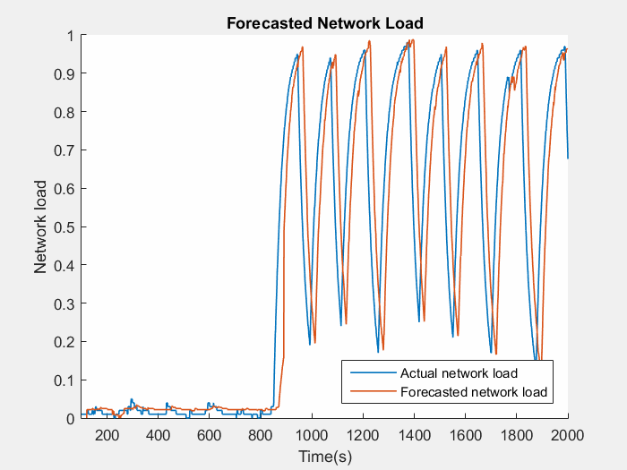

## AutoForecaster Sample

This sample demonstrates how to use the **AutoForecaster** operator. The **AutoForecaster** operator enables developers to easily add forecasting analysis to their applications. This operator automatically selects the best algorithm to use for forecasting by analyzing the incoming data.

In this sample, network load is analyzed using the autoforecaster and future values are forecasted.

More information about this operator can be found here: [Predicting the Future in a Streams Application](https://developer.ibm.com/streamsdev/docs/predicting-the-future-in-a-streams-application/)
