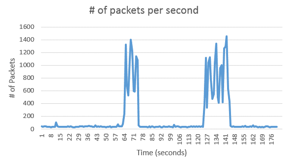
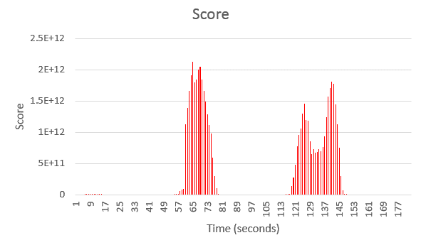

# Timeseries Samples

The following sample application demonstrate how to use some of the operators found in the **com.ibm.streams.timeseries** toolkit.

## AnomalyDetector Sample

This sample demonstrates how to use the **AnomalyDetector** operator. The **AnomalyDetector** operator is capable of performing online anomaly detection of a time series.

In this sample, the incoming time series represents the number of packets per second that a NIC received, sampled every second over a 3 minute (180 second) period. Here is an example of what the incoming data looks like:

As can be seen from the above, there are 2 obvious anomalies around 60 seconds and 130 seconds. After streaming the data through the AnomalyDetector operator, the following scores (confidence values) were calculated.

From the above chart, we can see that around the same time that the packet count spiked, the score returned by the AnomalyDetector jumps dramatically.

More information about this operator can be found here: [Anomaly Detection in Streams](https://developer.ibm.com/streamsdev/docs/anomaly-detection-in-streams/)

## AutoForecaster Sample

This sample demonstrates how to use the **AutoForecaster** operator. The **AutoForecaster** operator enables developers to easily add forecasting analysis to their applications. This operator automatically selects the best algorithm to use for forecasting by analyzing the incoming data. 

In this sample, network load is analyzed using the autoforecaster and future values are forecasted. 

More information about this operator can be found here: [Predicting the Future in a Streams Application](https://developer.ibm.com/streamsdev/docs/predicting-the-future-in-a-streams-application/)

## DSPFilter Bandpass Example

This sample demonstrates how to construct a bandpass filter using the **DSPFilter** operator. The **DSPFilter** operator implements a butterworth filter in order to isolate (or filter out) frequencies in a time series.

This example is explained in detail in the following article: [Bandpass and bandstop filter using the DSPFilter operator](https://developer.ibm.com/streamsdev/docs/bandpass-bandstop-filters-using-dspfilter-operator/)

## DSPFilterFinite Sample

This sample demonstrates how to use the **DSPFilterFinite** operator. Unlike the **DSPFilter** operator, which performs filtering against single, continuous time series, the **DSPFilterFinite** operator is capable of filtering finite-length time series segments. This is useful where only segments of a time series need to be filtered or whether each incoming tuple contains a list of a complete time series. 

## STD2 Sample

There are a number of samples in `STD2Samples` folder that demonstrate how the **STD2** operator can be used. The **STD2** operator is capable of decomposing a time series signal into _seasonal_, _trend_ and _residual_ components. The folder contains the following samples: 

  * **STD2Basic.spl** - This sample demonstrates a simple demonstration of how to use the **STD2** operator with a continuous time series. 
  * **STD2FiniteLength.spl** - This samples demonstrates how to configure the operator in order to analyze finite-length time series (signal segments)
  * **STD2Random.spl** - This samples demonstrates how to generate random time series data and analyze it using the STD2 operator. The generated time series data contain _seasonal_, _trend_ and _residual_ components. 
  * **STD2Anomaly.spl** - This samples demonstrates how to use the STD2 operator in conjunction with the **AnomalyDetector** operator in order to perform anomaly detection on seasonal data. More information about how this is done can be found here: [Detecting Anomalies in Seasonal Data](https://developer.ibm.com/streamsdev/2016/05/03/detecting-anomalies-in-seasonal-data/)

## KMeansClustering Control Signal Sample

This samples demonstrates how to send a control signal to the **KMeansClustering** operator. 
